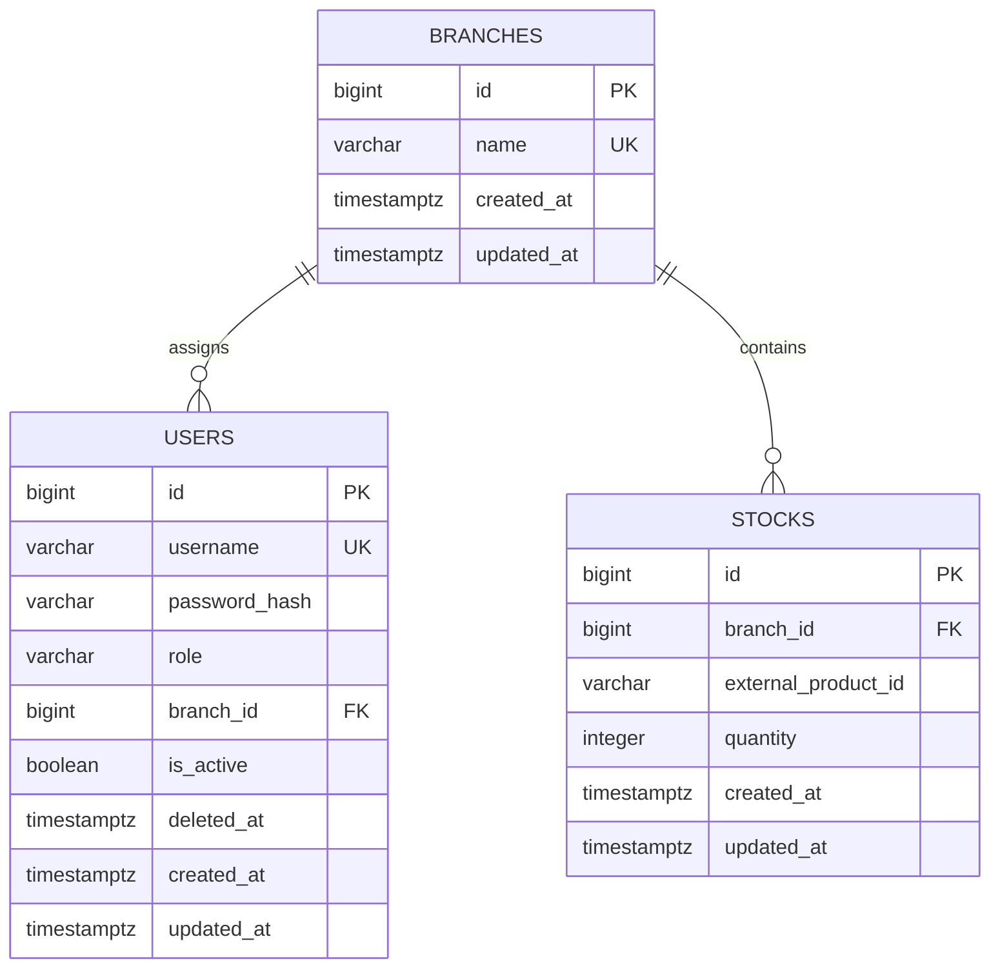

# Database Schema — Backoffice Stock & AI

## 1. Document Purpose

This document defines the PostgreSQL schema used by the Backoffice Stock & AI project.

It describes:

- the local tables;
- their fields and SQL types;
- primary and foreign keys;
- uniqueness and validation constraints;
- SQLAlchemy relationships;
- soft-deletion rules;
- stock transaction and concurrency rules;
- database indexes;
- initialization requirements;
- the minimum tests required for the data layer.

This document is based on the project specification, `project_context.md`, and `architecture.md`.

---

## 2. Scope

The local PostgreSQL database stores only:

- internal users;
- branches;
- user-to-branch assignments;
- password hashes;
- account status;
- external product identifiers;
- stock quantities.

The local database must not contain a local `products` table.

Product names, descriptions, prices, images, categories, and metadata remain managed by the provided read-only Product API.

---

## 3. Confirmed Technical Decisions

| Topic | Decision |
|---|---|
| Database engine | PostgreSQL |
| ORM | SQLAlchemy |
| Migrations | Flask-Migrate and Alembic |
| Password hashing | bcrypt |
| Authentication | Server-side session authentication |
| User deletion | Soft deletion |
| Product storage | External identifier only |
| Stock MCP | Custom and strictly read-only |
| Stock quantity | Integer greater than or equal to zero |
| Stock changes | Database transaction required |

---

## 4. Naming and Type Conventions

The schema follows these conventions:

- table names use plural `snake_case`;
- column names use `snake_case`;
- primary keys use `BIGINT`;
- timestamps use `TIMESTAMP WITH TIME ZONE`;
- timestamps are stored in UTC;
- boolean values use PostgreSQL `BOOLEAN`;
- constraint and index names are explicit;
- external product identifiers are treated as opaque identifiers.

The external product identifier is stored as `VARCHAR(255)` unless the provided Product API contract later requires a different type.

Treating the identifier as an opaque string prevents the Backoffice from making assumptions about how the external product system generates its identifiers.

---

## 5. Entity-Relationship Diagram



There is intentionally no relationship to a local product table.

`stocks.external_product_id` refers to a product managed by the provided Product API.

---

## 6. `branches` Table

A branch represents one physical company location.

### 6.1 Fields

| Column | PostgreSQL type | Nullable | Default | Description |
|---|---|---:|---|---|
| `id` | `BIGINT` | No | Generated | Primary key |
| `name` | `VARCHAR(120)` | No | None | Public branch name |
| `created_at` | `TIMESTAMPTZ` | No | Current timestamp | Creation time |
| `updated_at` | `TIMESTAMPTZ` | No | Current timestamp | Last modification time |

### 6.2 Constraints

| Constraint | Rule |
|---|---|
| `pk_branches` | `id` is the primary key |
| `uq_branches_name` | `name` must be unique |
| `ck_branches_name_not_blank` | `name` must not be empty or contain only spaces |

### 6.3 Business Rules

- Each branch has one stable identifier.
- A branch may have several common users.
- A branch may have several stock records.
- Creating and deleting branches is not part of the mandatory functional scope unless the team explicitly adds it.
- A referenced branch must not be physically deleted.
- Renaming a branch must not change its identifier.

### 6.4 SQLAlchemy Relationship Guidance

```text
Branch.users  -> one-to-many User
Branch.stocks -> one-to-many Stock
```

Recommended relationship behavior:

- do not use delete cascade from `Branch` to `User`;
- do not use delete cascade from `Branch` to `Stock`;
- use database-level `ON DELETE RESTRICT`.

This prevents accidental loss of user assignments or stock records.

---

## 7. `users` Table

A user represents an authenticated internal Backoffice account.

The application supports exactly two roles:

```text
admin
common_user
```

### 7.1 Fields

| Column | PostgreSQL type | Nullable | Default | Description |
|---|---|---:|---|---|
| `id` | `BIGINT` | No | Generated | Primary key |
| `username` | `VARCHAR(80)` | No | None | Login identifier |
| `password_hash` | `VARCHAR(255)` | No | None | bcrypt password hash |
| `role` | `VARCHAR(20)` | No | `common_user` | Authorization role |
| `branch_id` | `BIGINT` | Conditional | None | Assigned branch for a common user |
| `is_active` | `BOOLEAN` | No | `TRUE` | Whether login is allowed |
| `deleted_at` | `TIMESTAMPTZ` | Yes | `NULL` | Soft-deletion timestamp |
| `created_at` | `TIMESTAMPTZ` | No | Current timestamp | Creation time |
| `updated_at` | `TIMESTAMPTZ` | No | Current timestamp | Last modification time |

### 7.2 Constraints

| Constraint | Rule |
|---|---|
| `pk_users` | `id` is the primary key |
| `uq_users_username` | `username` must be unique |
| `fk_users_branch_id` | `branch_id` references `branches.id` |
| `ck_users_role` | `role` must be `admin` or `common_user` |
| `ck_users_username_not_blank` | `username` must not be blank |
| `ck_users_branch_assignment` | `admin` has no branch; `common_user` has exactly one branch |
| `ck_users_admin_username` | The administrator username must be `admin` |
| `ck_users_reserved_admin_username` | A common user cannot use the username `admin` |
| `ck_users_soft_delete_state` | Active users have no `deleted_at`; soft-deleted users have a `deleted_at` |
| `uq_users_single_admin` | PostgreSQL partial unique index allowing only one row with role `admin` |

### 7.3 Administrator Invariants

The database and application must enforce these rules:

- exactly one administrator account is expected;
- the administrator username is `admin`;
- no route may create a second administrator;
- a common user cannot be promoted to administrator;
- the administrator has no assigned branch;
- the administrator cannot be soft-deleted through normal application functionality;
- the administrator cannot add or remove stock.

The database can enforce that there is **at most one** administrator.  
Application initialization is responsible for ensuring that the one required administrator actually exists.

### 7.4 Common User Invariants

A common user:

- must be assigned to exactly one branch;
- cannot exist without a valid `branch_id`;
- can be reassigned to another existing branch by the administrator;
- can be soft-deleted;
- cannot access the Backoffice after soft deletion;
- cannot manage users;
- cannot operate on stock belonging to another branch.

### 7.5 Username Policy

Usernames are stored in normalized lowercase form.

The service layer must:

1. trim surrounding spaces;
2. convert the username to lowercase;
3. reject an empty username;
4. check uniqueness before insertion.

The database uniqueness constraint remains the final protection against duplicate usernames.

A soft-deleted username remains reserved and cannot be reused. This avoids login ambiguity and preserves a stable audit identity.

### 7.6 Password Hash Storage

Only the bcrypt hash is stored.

A separate salt column is not required because bcrypt includes its salt and cost parameters inside the encoded hash.

The database must never store:

- a plain-text password;
- a reversible encrypted password;
- a password hint;
- the password in a log or audit field.

### 7.7 SQLAlchemy Relationship Guidance

```text
User.branch -> many-to-one Branch
```

Recommended foreign-key behavior:

```text
users.branch_id -> branches.id ON DELETE RESTRICT
```

The `branch_id` column is nullable at the SQL level only because the administrator has no branch. A check constraint enforces the role-specific rule.

---

## 8. `stocks` Table

A stock record represents the available quantity of one external product in one branch.

### 8.1 Fields

| Column | PostgreSQL type | Nullable | Default | Description |
|---|---|---:|---|---|
| `id` | `BIGINT` | No | Generated | Primary key |
| `branch_id` | `BIGINT` | No | None | Branch holding the stock |
| `external_product_id` | `VARCHAR(255)` | No | None | Product identifier from the Product API |
| `quantity` | `INTEGER` | No | `0` | Available quantity |
| `created_at` | `TIMESTAMPTZ` | No | Current timestamp | Creation time |
| `updated_at` | `TIMESTAMPTZ` | No | Current timestamp | Last modification time |

### 8.2 Constraints

| Constraint | Rule |
|---|---|
| `pk_stocks` | `id` is the primary key |
| `fk_stocks_branch_id` | `branch_id` references `branches.id` |
| `uq_stocks_branch_product` | `branch_id + external_product_id` must be unique |
| `ck_stocks_external_product_id_not_blank` | External product identifier must not be blank |
| `ck_stocks_quantity_non_negative` | `quantity >= 0` |

Recommended foreign-key behavior:

```text
stocks.branch_id -> branches.id ON DELETE RESTRICT
```

### 8.3 Business Rules

- A product has at most one stock record per branch.
- Quantity is always an integer.
- Quantity can never be negative.
- An added quantity must be a strictly positive integer.
- A removed quantity must be a strictly positive integer.
- Removing more than the available quantity must be rejected.
- A stock record remains present when its quantity reaches zero.
- A zero quantity means that the product is currently out of stock in that branch.
- Stock records are not automatically deleted.
- The external product must exist before the first stock addition.
- No product details are copied into this table.
- All stock changes occur inside a database transaction.

### 8.4 No Local Product Foreign Key

`external_product_id` is not a foreign key because the product belongs to an external system.

The local database must not create a `products` table simply to satisfy a foreign-key relationship.

Existence is validated through the Product API before stock is first created or increased.

---

## 9. Relationship Summary

| Parent | Child | Relationship | Delete behavior |
|---|---|---|---|
| `branches` | `users` | One-to-many | Restrict physical deletion |
| `branches` | `stocks` | One-to-many | Restrict physical deletion |
| External Product API | `stocks.external_product_id` | Logical external reference | No local foreign key |

---

## 10. Indexes

The following indexes are required or recommended.

| Index | Columns | Purpose |
|---|---|---|
| `uq_branches_name` | `branches.name` | Enforce unique branch names |
| `uq_users_username` | `users.username` | Login lookup and uniqueness |
| `ix_users_branch_id` | `users.branch_id` | List users assigned to a branch |
| `ix_users_active` | `users.is_active` | Filter active or disabled users |
| `uq_users_single_admin` | Partial index on `users.role = 'admin'` | Allow at most one administrator |
| `uq_stocks_branch_product` | `stocks.branch_id`, `stocks.external_product_id` | Enforce one record per branch and product |
| `ix_stocks_external_product_id` | `stocks.external_product_id` | Find all branches holding a product |
| `ix_stocks_branch_quantity` | `stocks.branch_id`, `stocks.quantity` | List available products for a branch |

The index on `stocks.external_product_id` is important for AI questions such as:

```text
Which branches have product X?
```

The composite branch-and-product unique index supports queries such as:

```text
What is the quantity of product X in branch Y?
```

---

## 11. Stock Transactions and Concurrency

Stock changes must be atomic.

PostgreSQL transactions are required for both additions and removals.

## 11.1 Adding Stock

Required flow:

1. validate that the requested quantity is a strictly positive integer;
2. determine the branch from the authenticated common user;
3. call the Product API and verify that the external product exists;
4. begin a database transaction;
5. find the stock record for the branch and external product;
6. lock the existing row when present;
7. create the record or increase its quantity;
8. commit the transaction;
9. roll back the transaction if any error occurs.

The unique constraint on `branch_id + external_product_id` protects against duplicate stock rows.

If concurrent first additions attempt to create the same record, the service must handle the uniqueness conflict safely, retry the operation when appropriate, or use a PostgreSQL upsert strategy.

## 11.2 Removing Stock

Required flow:

1. validate that the requested quantity is a strictly positive integer;
2. determine the branch from the authenticated common user;
3. begin a database transaction;
4. select the matching stock row using a row lock;
5. reject the operation if the row does not exist;
6. reject the operation if the available quantity is insufficient;
7. subtract the requested quantity;
8. keep the row even if the new quantity is zero;
9. commit the transaction;
10. roll back the transaction if any error occurs.

Recommended PostgreSQL strategy:

```sql
SELECT ...
FROM stocks
WHERE branch_id = :branch_id
  AND external_product_id = :external_product_id
FOR UPDATE;
```

In SQLAlchemy, the equivalent operation should use row-level locking, such as `with_for_update()`.

This prevents two concurrent removals from both reading the same original quantity and producing a negative result.

## 11.3 Authorization and Branch Selection

For a common user, the backend must obtain `branch_id` from the authenticated user record.

The backend must not trust a branch identifier supplied freely by the browser for stock modification.

An administrator must be rejected before any stock write transaction begins.

---

## 12. Soft Deletion

Only common users are soft-deleted.

A soft deletion performs these changes:

```text
is_active = false
deleted_at = current UTC timestamp
```

The user row remains in the database.

Consequences:

- the user cannot log in;
- historical identity remains available;
- the username remains reserved;
- the branch assignment may remain for traceability;
- no stock data is deleted.

Restoring a soft-deleted user is not part of the mandatory scope unless the team explicitly adds it.

Physical deletion of users is not exposed by the application.

---

## 13. Administrator Initialization

The `admin` user must be created during project initialization.

Requirements:

- username is exactly `admin`;
- role is `admin`;
- `branch_id` is `NULL`;
- password is received from a secure environment variable or an explicit initialization command;
- password is hashed with bcrypt before insertion;
- no default password is committed to Git;
- initialization must be idempotent;
- a second administrator must never be created.

Recommended environment variable:

```text
ADMIN_INITIAL_PASSWORD
```

Recommended initialization behavior:

1. run database migrations;
2. check whether the `admin` user exists;
3. if it does not exist, require `ADMIN_INITIAL_PASSWORD`;
4. hash the password with bcrypt;
5. create the administrator;
6. never print the password or hash to logs.

The exact command or startup hook will be defined during implementation.

---

## 14. SQLAlchemy Model Guidance

Recommended SQLAlchemy models:

```text
Branch
User
Stock
```

Recommended shared timestamp behavior:

- `created_at` is set when the row is inserted;
- `updated_at` is updated whenever the row changes;
- both values use timezone-aware UTC timestamps.

Recommended database configuration:

- enable SQLAlchemy connection health checks;
- use `pool_pre_ping=True`;
- avoid implicit commits;
- keep transaction boundaries in the service layer;
- do not place HTTP calls inside a database transaction unless strictly necessary.

The Product API existence check should normally occur before opening the stock transaction, so a slow network call does not hold a database lock.

Because the Product API may change between validation and commit, the external identifier is treated as a validated reference, not as a database-enforced foreign key.

---

## 15. Database Accounts and Permissions

At minimum, two PostgreSQL access levels are recommended.

### 15.1 Backoffice Database Account

The Backoffice account may:

- read `users`, `branches`, and `stocks`;
- insert and update allowed rows;
- run application migrations only through the dedicated migration process.

The Backoffice account must not be a PostgreSQL superuser.

### 15.2 Stock MCP Database Account

If the team chooses direct PostgreSQL access for the Stock MCP, it must use a separate read-only account.

The read-only account may access only the columns required for stock questions:

- branch identifiers;
- public branch names;
- external product identifiers;
- available quantities.

It must not have access to:

- `users.password_hash`;
- private employee data;
- insert, update, or delete operations;
- schema modification;
- unrestricted administrative functions.

If the team instead chooses an internal read-only Backoffice API, the Stock MCP will not receive PostgreSQL credentials.

---

## 16. Migration Strategy

All schema changes must be applied through Flask-Migrate and Alembic.

Required rules:

- never modify the production schema manually;
- each schema change receives its own migration;
- migration files are committed to Git;
- migrations must be reviewed;
- migrations must support a clean database setup;
- integration tests must run migrations on PostgreSQL;
- destructive migrations require explicit team approval.

Initial migration order:

1. create `branches`;
2. create `users`;
3. create `stocks`;
4. add constraints and indexes;
5. initialize the `admin` user through the application initialization process.

The administrator password must not appear in a migration file.

---

## 17. Required Data-Layer Tests

## 17.1 Branch Tests

- branch name is required;
- branch name cannot be blank;
- branch name is unique;
- a referenced branch cannot be physically deleted.

## 17.2 User Tests

- username is required;
- username is normalized;
- username is unique;
- password hash is stored instead of the plain password;
- only `admin` and `common_user` roles are accepted;
- only one administrator can exist;
- the administrator username is `admin`;
- a common user cannot use the reserved username `admin`;
- the administrator has no branch;
- a common user must have exactly one branch;
- a disabled user cannot authenticate;
- soft deletion sets `is_active` and `deleted_at` consistently;
- a soft-deleted username cannot be reused.

## 17.3 Stock Tests

- branch is required;
- external product identifier is required;
- external product identifier cannot be blank;
- one branch/product pair has only one stock record;
- quantity defaults to zero;
- negative quantity is rejected by PostgreSQL;
- adding a positive quantity succeeds;
- adding zero is rejected by the service;
- removing zero is rejected by the service;
- removing a negative quantity is rejected by the service;
- removing more than the available stock is rejected;
- quantity never becomes negative;
- a zero-quantity stock record remains in the database;
- an unknown external product is rejected before addition;
- stock changes are rolled back on error.

## 17.4 Concurrency Tests

- two concurrent removals cannot make stock negative;
- concurrent additions do not create duplicate stock rows;
- a failed transaction does not partially update quantity;
- row locking behaves correctly with PostgreSQL.

## 17.5 Permission Tests

- a common user modifies only their assigned branch;
- a supplied foreign `branch_id` is ignored or rejected;
- the administrator cannot add stock;
- the administrator cannot remove stock;
- the Stock MCP database account cannot write;
- the Stock MCP cannot read password hashes.

---

## 18. Data Explicitly Out of Scope

The local database does not store:

- product names;
- product descriptions;
- product prices;
- product images;
- product categories;
- product metadata;
- conversation history;
- public-user accounts;
- AI-generated answers;
- unrestricted agent SQL;
- plain-text passwords.

No table should be added for these values without a new approved architecture decision.

---

## 19. Decisions Still Requiring Team Confirmation

The core schema is defined, but these implementation details still require team approval:

- whether the Stock MCP reads PostgreSQL directly or uses an internal read-only API;
- the exact bcrypt cost factor;
- the exact administrator initialization command;
- whether branch names are case-sensitive;
- whether additional public branch fields are needed;
- the exact PostgreSQL lock or upsert implementation used for concurrent additions;
- whether a future audit-log table will be added.

These decisions must not weaken the mandatory constraints defined in this document.

---

## 20. Definition of Done for the Database Schema

The database schema is considered complete when:

- all three SQLAlchemy models are implemented;
- migrations create the schema from an empty PostgreSQL database;
- all required constraints exist in PostgreSQL;
- the single `admin` account can be initialized securely;
- no product details are stored locally;
- bcrypt hashes are used for passwords;
- soft deletion works;
- stock changes use transactions;
- concurrent removals cannot make quantity negative;
- required indexes exist;
- unit and PostgreSQL integration tests pass;
- another team member reviews the migration and models;
- the Pull Request is approved and merged into `main`.
