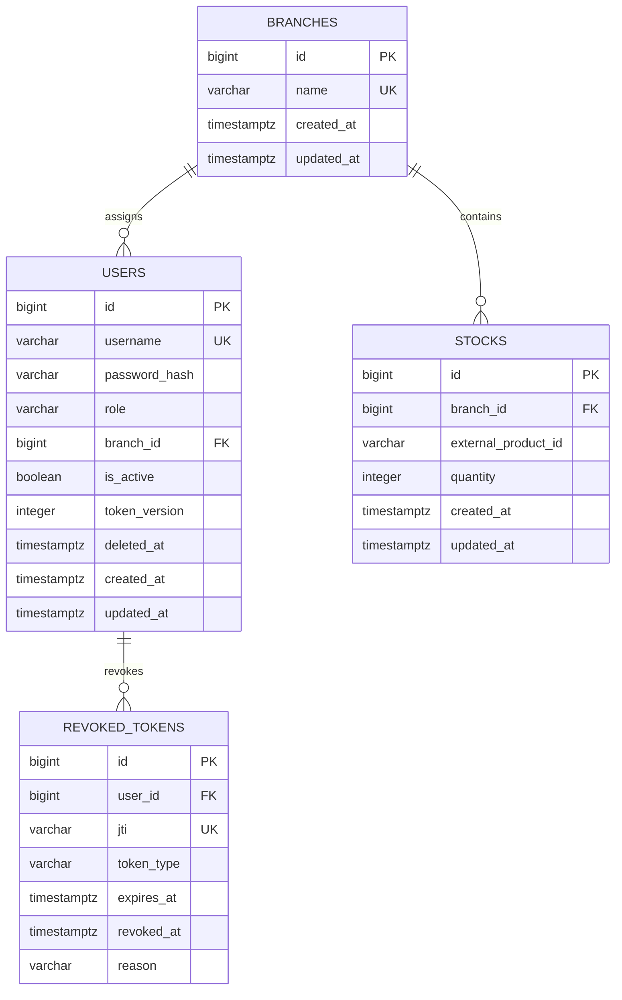

# Schéma de base de données — HBntory

## 1. Objectif

Ce document définit le schéma PostgreSQL du Backoffice HBntory.

Il couvre :

- les utilisateurs ;
- les succursales ;
- les stocks ;
- la révocation JWT ;
- les relations SQLAlchemy ;
- les contraintes ;
- les index ;
- l’initialisation ;
- les transactions ;
- les permissions PostgreSQL.

La base locale ne contient aucune table `products`.

---

## 2. Décisions confirmées

| Sujet | Décision |
|---|---|
| SGBD | PostgreSQL |
| ORM | SQLAlchemy |
| Migrations | Flask-Migrate et Alembic |
| Authentification | JWT Bearer |
| Access token | 30 minutes |
| Refresh token | 7 jours |
| Hachage des mots de passe | bcrypt |
| Suppression des utilisateurs | Suppression logique |
| Révocation individuelle | Table `revoked_tokens` |
| Révocation globale d’un utilisateur | `users.token_version` |
| Stock produit | Identifiant externe uniquement |
| Stock MCP | Compte PostgreSQL distinct en lecture seule |

---

## 3. Justification des tables

Les tables obligatoires du métier sont :

```text
users
branches
stocks
```

La table supplémentaire :

```text
revoked_tokens
```

est justifiée directement par le choix JWT avec blocklist. Elle n’est pas ajoutée pour simuler une fonction métier facultative.

Elle stocke uniquement les identifiants techniques `jti` des tokens révoqués, jamais les tokens complets.

---

## 4. Conventions

- tables et colonnes en `snake_case` ;
- clés primaires en `BIGINT` ;
- horodatages en `TIMESTAMPTZ` et UTC ;
- identifiants produits externes en `VARCHAR(255)` ;
- contraintes et index nommés explicitement ;
- aucun mot de passe en clair ;
- aucun détail produit local.

---

## 5. Diagramme entité-relation



---

## 6. Table `branches`

| Colonne | Type | Nullable | Défaut | Description |
|---|---|---:|---|---|
| `id` | `BIGINT` | Non | Générée | Clé primaire |
| `name` | `VARCHAR(120)` | Non | Aucun | Nom public |
| `created_at` | `TIMESTAMPTZ` | Non | Maintenant | Création |
| `updated_at` | `TIMESTAMPTZ` | Non | Maintenant | Modification |

Contraintes :

```text
pk_branches
uq_branches_name
ck_branches_name_not_blank
```

Règles :

- au moins deux succursales sont créées pour les données initiales ;
- un nom est normalisé en supprimant les espaces extérieurs ;
- aucune suppression physique n’est exposée dans le MVP ;
- `ON DELETE RESTRICT` protège les utilisateurs et stocks liés.

Relations SQLAlchemy :

```text
Branch.users
Branch.stocks
```

---

## 7. Table `users`

| Colonne | Type | Nullable | Défaut | Description |
|---|---|---:|---|---|
| `id` | `BIGINT` | Non | Générée | Clé primaire |
| `username` | `VARCHAR(80)` | Non | Aucun | Identifiant normalisé |
| `password_hash` | `VARCHAR(255)` | Non | Aucun | Hash bcrypt |
| `role` | `VARCHAR(20)` | Non | `common_user` | Rôle |
| `branch_id` | `BIGINT` | Conditionnel | `NULL` | Succursale du common user |
| `is_active` | `BOOLEAN` | Non | `TRUE` | Connexion autorisée |
| `token_version` | `INTEGER` | Non | `0` | Version globale des JWT |
| `deleted_at` | `TIMESTAMPTZ` | Oui | `NULL` | Suppression logique |
| `created_at` | `TIMESTAMPTZ` | Non | Maintenant | Création |
| `updated_at` | `TIMESTAMPTZ` | Non | Maintenant | Modification |

Contraintes :

```text
pk_users
uq_users_username
fk_users_branch_id
ck_users_username_not_blank
ck_users_role
ck_users_branch_assignment
ck_users_admin_username
ck_users_reserved_admin_username
ck_users_soft_delete_state
ck_users_token_version_non_negative
uq_users_single_admin
```

### 7.1 Invariants de l’administrateur

- un seul rôle `admin` est autorisé par un index unique partiel ;
- son nom est exactement `admin` ;
- `branch_id` vaut `NULL` ;
- il n’est pas supprimable par le fonctionnement normal ;
- aucune route ne crée un deuxième administrateur ;
- aucune route ne modifie son rôle ;
- il ne peut pas modifier le stock.

### 7.2 Invariants des utilisateurs communs

- rôle `common_user` ;
- exactement une succursale ;
- nom différent de `admin` ;
- possibilité de suppression logique ;
- connexion refusée si `is_active = false` ou `deleted_at IS NOT NULL`.

### 7.3 Normalisation du nom d’utilisateur

La couche de service :

1. applique `strip()` ;
2. convertit en minuscules ;
3. refuse la chaîne vide ;
4. laisse PostgreSQL garantir l’unicité finale.

Le nom d’un compte supprimé reste réservé.

### 7.4 `token_version`

La valeur est incluse dans chaque access token et refresh token.

Lors d’un changement de mot de passe :

```text
token_version = token_version + 1
```

Tous les anciens tokens deviennent immédiatement invalides lors de leur comparaison avec la valeur actuelle en base.

---

## 8. Table `stocks`

| Colonne | Type | Nullable | Défaut | Description |
|---|---|---:|---|---|
| `id` | `BIGINT` | Non | Générée | Clé primaire |
| `branch_id` | `BIGINT` | Non | Aucun | Succursale |
| `external_product_id` | `VARCHAR(255)` | Non | Aucun | Identifiant API Produit |
| `quantity` | `INTEGER` | Non | `0` | Quantité disponible |
| `created_at` | `TIMESTAMPTZ` | Non | Maintenant | Création |
| `updated_at` | `TIMESTAMPTZ` | Non | Maintenant | Modification |

Contraintes :

```text
pk_stocks
fk_stocks_branch_id
uq_stocks_branch_product
ck_stocks_external_product_id_not_blank
ck_stocks_quantity_non_negative
```

Règles :

- un seul enregistrement par succursale et produit ;
- aucune quantité négative ;
- une ligne reste présente à zéro ;
- aucun nom, prix ou détail produit ;
- existence du produit vérifiée par l’API avant le premier ajout ;
- `ON DELETE RESTRICT` sur la succursale.

---

## 9. Table `revoked_tokens`

| Colonne | Type | Nullable | Défaut | Description |
|---|---|---:|---|---|
| `id` | `BIGINT` | Non | Générée | Clé primaire |
| `user_id` | `BIGINT` | Non | Aucun | Propriétaire du token |
| `jti` | `VARCHAR(255)` | Non | Aucun | Identifiant unique du JWT |
| `token_type` | `VARCHAR(20)` | Non | Aucun | `access` ou `refresh` |
| `expires_at` | `TIMESTAMPTZ` | Non | Aucun | Expiration naturelle |
| `revoked_at` | `TIMESTAMPTZ` | Non | Maintenant | Révocation |
| `reason` | `VARCHAR(50)` | Oui | `NULL` | Motif technique |

Contraintes :

```text
pk_revoked_tokens
fk_revoked_tokens_user_id
uq_revoked_tokens_jti
ck_revoked_tokens_jti_not_blank
ck_revoked_tokens_type
```

Règles :

- aucun JWT complet n’est stocké ;
- une entrée peut être supprimée après `expires_at` ;
- l’accès à cette table est interdit au Stock MCP ;
- `ON DELETE RESTRICT` conserve la cohérence avec la suppression logique des utilisateurs.

---

## 10. Relations

| Parent | Enfant | Relation | Suppression |
|---|---|---|---|
| `branches` | `users` | Un-à-plusieurs | Restrict |
| `branches` | `stocks` | Un-à-plusieurs | Restrict |
| `users` | `revoked_tokens` | Un-à-plusieurs | Restrict |
| API Produit | `stocks.external_product_id` | Référence externe logique | Pas de FK locale |

---

## 11. Index

| Index | Colonnes | But |
|---|---|---|
| `uq_branches_name` | `branches.name` | Unicité |
| `uq_users_username` | `users.username` | Connexion et unicité |
| `ix_users_branch_id` | `users.branch_id` | Affectations |
| `ix_users_active` | `users.is_active` | Comptes actifs |
| `uq_users_single_admin` | rôle admin, index partiel | Un seul admin |
| `uq_stocks_branch_product` | branche + produit | Un stock unique |
| `ix_stocks_external_product_id` | produit | Recherche multi-succursales |
| `ix_stocks_branch_quantity` | branche + quantité | Produits disponibles |
| `uq_revoked_tokens_jti` | `jti` | Vérification blocklist |
| `ix_revoked_tokens_expires_at` | expiration | Nettoyage |
| `ix_revoked_tokens_user_id` | utilisateur | Audit technique |

---

## 12. Validation : emplacement des règles

### PostgreSQL

Protection finale pour :

- unicité ;
- clés étrangères ;
- rôles valides ;
- quantité non négative ;
- cohérence rôle/succursale ;
- cohérence suppression logique.

### SQLAlchemy Models

Représentation :

- relations ;
- contraintes ;
- types ;
- horodatages.

### Couche de service

Règles nécessitant du contexte :

- quantité ajoutée ou retirée strictement positive ;
- autorisation par rôle ;
- branche issue de l’utilisateur authentifié ;
- existence du produit externe ;
- retrait inférieur ou égal au stock ;
- hachage de mot de passe ;
- incrément de `token_version`.

Les routes ne contiennent pas la logique métier principale.

---

## 13. Transactions et concurrence

### 13.1 Ajout

1. valider la quantité ;
2. charger la branche depuis l’utilisateur ;
3. vérifier le produit via l’API ;
4. ouvrir une transaction ;
5. verrouiller la ligne existante ou utiliser un upsert ;
6. ajouter la quantité ;
7. commit ;
8. rollback complet en cas d’erreur.

L’appel réseau est effectué avant la transaction.

### 13.2 Retrait

1. valider la quantité ;
2. charger la branche depuis l’utilisateur ;
3. ouvrir une transaction ;
4. sélectionner la ligne avec `FOR UPDATE`;
5. refuser une ligne absente ;
6. refuser un stock insuffisant ;
7. soustraire ;
8. conserver la ligne à zéro ;
9. commit ou rollback.

Deux retraits concurrents ne peuvent pas utiliser la même quantité initiale.

---

## 14. Initialisation obligatoire

La commande d’initialisation doit être idempotente.

Elle crée au minimum :

- l’utilisateur `admin` ;
- deux succursales ;
- du stock de démonstration.

### 14.1 Administrateur

- mot de passe reçu par `ADMIN_INITIAL_PASSWORD` ;
- hash bcrypt avant insertion ;
- aucun mot de passe dans une migration ;
- aucune valeur par défaut commise dans Git.

### 14.2 Succursales

Les noms peuvent provenir d’un fichier de seed contrôlé, par exemple :

```json
{
  "branches": [
    {"name": "Toulon"},
    {"name": "Marseille"}
  ]
}
```

### 14.3 Stock de démonstration

Le fichier contient uniquement :

```json
{
  "branch": "Toulon",
  "external_product_id": "product-123",
  "quantity": 10
}
```

Avant insertion :

1. la branche est résolue ;
2. la quantité est validée ;
3. le produit est vérifié dans l’API Produit ;
4. tous les stocks valides sont insérés dans une transaction unique.

Si l’API Produit est indisponible ou si un identifiant est inconnu, aucun stock partiel n’est validé.

---

## 15. Comptes PostgreSQL

### Compte Backoffice

Permissions nécessaires sur les tables applicatives.

Pas de privilège superutilisateur.

### Compte migrations

Utilisé uniquement pour les migrations.

### Compte Stock MCP

Permissions :

```text
SELECT sur branches
SELECT sur stocks
```

Interdictions :

```text
INSERT
UPDATE
DELETE
TRUNCATE
ALTER
DROP
SELECT sur users
SELECT sur revoked_tokens
```

---

## 16. Migrations

Ordre initial :

1. `branches`;
2. `users`;
3. `stocks`;
4. `revoked_tokens`;
5. contraintes et index ;
6. commande d’initialisation séparée.

Règles :

- migrations enregistrées dans Git ;
- testées sur PostgreSQL vide ;
- pas de mot de passe dans les migrations ;
- modifications destructrices soumises à l’accord de l’équipe.

---

## 17. Tests de données obligatoires

### Branches

- nom obligatoire, non vide et unique ;
- au moins deux branches après initialisation ;
- suppression physique d’une branche référencée refusée.

### Utilisateurs

- nom normalisé et unique ;
- rôles limités ;
- un seul admin ;
- admin sans branche ;
- common user avec exactement une branche ;
- mot de passe jamais stocké en clair ;
- utilisateur supprimé incapable de se connecter ;
- `token_version` incrémenté après changement de mot de passe.

### Stocks

- couple branche/produit unique ;
- quantité par défaut à zéro ;
- quantité négative refusée ;
- ajout/retrait zéro ou négatif refusé par le service ;
- produit externe inconnu refusé ;
- ligne conservée à zéro ;
- rollback en cas d’erreur.

### Concurrence

- retraits concurrents sans stock négatif ;
- premiers ajouts concurrents sans doublon ;
- aucune mise à jour partielle.

### JWT

- `jti` unique ;
- types `access` et `refresh` uniquement ;
- token révoqué refusé ;
- ancien `token_version` refusé ;
- aucun JWT complet stocké.

### Permissions

- common user limité à sa branche ;
- admin interdit sur le stock ;
- Stock MCP incapable d’écrire ou de lire les tables privées.

---

## 18. Définition de terminé

Le schéma est terminé lorsque :

- les quatre modèles SQLAlchemy existent ;
- les migrations fonctionnent sur PostgreSQL vide ;
- l’initialisation crée admin, deux branches et stock de test ;
- toutes les contraintes sont effectives ;
- les transactions empêchent les stocks négatifs ;
- les permissions du Stock MCP sont vérifiées ;
- les tests PostgreSQL réussissent ;
- aucune donnée produit interdite n’est stockée.
